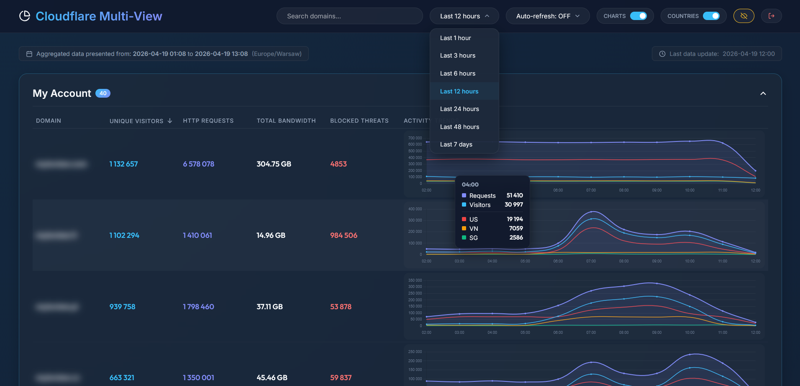
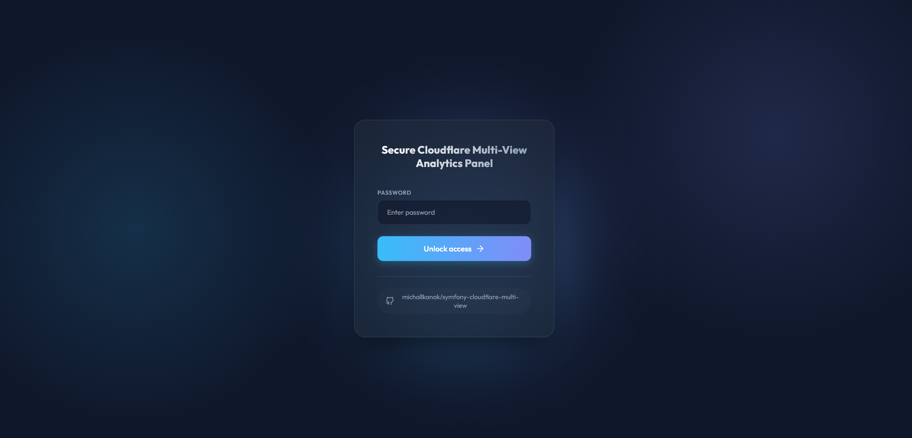

# Symfony Cloudflare Multi-View Bundle

[](https://github.com/michallkanak/symfony-cloudflare-multi-view/actions/workflows/tests.yml)
[](https://phpstan.org/)
[](https://cs.symfony.com/)
[](https://packagist.org/packages/michallkanak/symfony-cloudflare-multi-view)
[](https://symfony.com/)
[](https://www.php.net/)
[](LICENSE)

Symfony bundle for monitoring and visualizing traffic across multiple Cloudflare domains and accounts. It provides a beautiful, password-protected dashboard with real-time analytics, daily/hourly trends, and group-based organization.

### Dashboard Preview



### Secure Login



## Features

- **Multi-domain aggregation**: See stats for all your Cloudflare zones in one place.
- **Grouped view**: Organize domains into logical Cloudflare accounts groups for better management.
- **Modern Dashboard**: Sleek, glassmorphism UI with dark mode support.
- **Interactive Charts**: Responsive charts for requests and unique visitors (powered by Chart.js).
- **Timezone Support**: View data in your preferred local time.
- **Persistent State**: Remembers your sorting and chart visibility preferences.
- **Geographical Analytics**: Tracks Top 3 countries of origin for traffic with color-coded trend lines.
- **Security**: Password-protected dashboard isolated from your main app. Implements CSRF protection and honeypot to prevent bot attacks.
- **Scalable**: Built-in API rate limiting and retry logic for Cloudflare API.
- **Translations**: Built-in support for multiple languages: English, Polish, French, German, Spanish, Italian, Czech, Swedish.

## Installation

1. Install via composer:

   ```bash
   composer require michallkanak/symfony-cloudflare-multi-view
   ```

2. Register the bundle in `config/bundles.php`:
   ```php
   return [
       // ...
       Michallkanak\SymfonyCloudflareMultiView\CfMultiViewBundle::class => ['all' => true],
   ];
   ```

## Configuration

### 1. Main Configuration

Create `config/packages/cf_multi_view.yaml`:

```yaml
cf_multi_view:
  dashboard_password: "%env(CF_DASHBOARD_PASSWORD)%"
  secure_dashboard: true # set to false to disable password protection
  timezone: "Europe/Warsaw"

  accounts:
    - name: "Main Account"
      token: "%env(CF_TOKEN_MAIN)%"
    - name: "Staging Account"
      token: "%env(CF_TOKEN_STAGING)%"
```

Each `account.name` becomes the **group label** on the dashboard. Domains are automatically assigned to their account group.

### 2. Routing

Create `config/routes/cf_multi_view.yaml`:

```yaml
cf_multi_view:
  resource: "@CfMultiViewBundle/Resources/config/routes.yaml"
  prefix: "/cf-stats"
```

If you have admin panel in your symfony application, you can add this route to your admin panel routes.

## Usage & Commands

### 1. Domain Discovery

Pull domains from all configured Cloudflare accounts:

```bash
php bin/console cf-multi-view:fetch-domains

# Or only for a specific account
php bin/console cf-multi-view:fetch-domains --account="Main Account"
```

This command populates the database and assigns each domain to its account group.

### 2. Synchronizing Statistics

```bash
# Sync all accounts, last 24h, with period depends on your subscription plan (Free: 1h)
php bin/console cf-multi-view:sync-stats --start="-24 hours" --period="1h"

# Sync with geographical data (Top 3 countries)
php bin/console cf-multi-view:sync-stats --with-countries

# Sync a specific account only
php bin/console cf-multi-view:sync-stats --account="Main Account" --with-countries
```

#### Options for `sync-stats`:

| Option             | Description                                     | Default     |
| ------------------ | ----------------------------------------------- | ----------- |
| `--period`         | Data granularity: `1m` (Enterprise), `1h`, `1d` | `1h`        |
| `--start`          | Start of the range                              | `-25 hours` |
| `--end`            | End of the range                                | `now`       |
| `--with-countries` | Fetch Top 3 country breakdown                   | off         |
| `--account`        | Sync only a specific account                    | all         |

#### Recommended CRON:

```cron
*/5 * * * * php bin/console cf-multi-view:sync-stats --start="-2 hours" --with-countries > /dev/null 2>&1
```

### 3. Data Cleanup

#### Delete old statistics:

```bash
# Delete stats older than 90 days (asks for confirmation)
php bin/console cf-multi-view:purge-stats --older-than="90 days"

# Skip confirmation
php bin/console cf-multi-view:purge-stats --older-than="3 months" --force
```

#### Delete an entire account and all its data:

```bash
# Asks for confirmation
php bin/console cf-multi-view:delete-account --name="Staging Account"

# Skip confirmation
php bin/console cf-multi-view:delete-account --name="Staging Account" --force
```

## Requirements

- PHP 8.1+
- Symfony 5.4+
- Doctrine ORM
- Cloudflare API Token with the following permissions:
  - `Zone.Zone: Read`
  - `Zone.Analytics: Read`

## Translations

The bundle supports multiple languages out of the box for both the dashboard and CLI commands:

| Language | Code |
| -------- | ---- |
| English  | `en` |
| Polish   | `pl` |
| French   | `fr` |
| German   | `de` |
| Spanish  | `es` |
| Italian  | `it` |
| Czech    | `cs` |
| Swedish  | `sv` |

## Security

The dashboard is protected by a password defined in your configuration. By default, the bundle includes:

- **CSRF Protection**: Form tokens to prevent cross-site request forgery.
- **Honeypot**: Hidden fields to automatically reject bot attempts.

### Advanced IP Protection (Optional)

If you require IP-level protection (e.g., blocking an IP address after 5 failed attempts), we recommend using the standard Symfony `rate-limiter` component in your main application and targeting the `cf_multi_view_login` route.

## Contributing

Contributions are welcome! Please read the contributing guide `CONTRIBUTING.md` for details about our code of conduct, and the process for submitting pull requests to us.

## Credits

Created by [Michał Kanak](https://github.com/michallkanak)

## License

MIT
